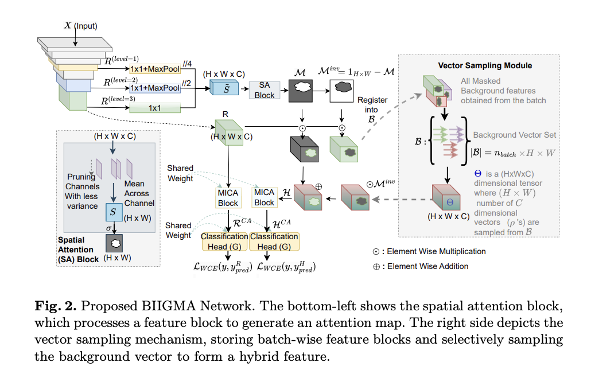
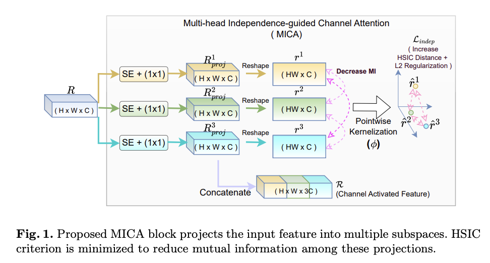
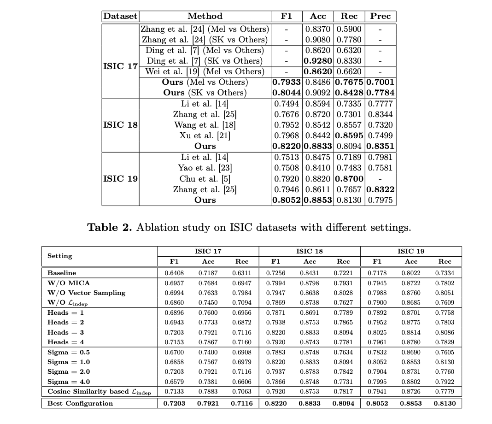

# BIIGMA-Net
### Official Implementation of Paper "Background-Invariant Independence-Guided Multi-head Attention Network for Skin Lesion Classification"

**Accepted at MICCAI 2025 (Main Conference)**

[Read the Paper](https://papers.miccai.org/miccai-2025/paper/2868_paper.pdf)

## Abstract
Biomedical image classification faces several adversarial challenges, including occlusions from artifacts, variations in tissue pigmentation, and class imbalance, which hinder model generalization. Existing attention mechanisms enhance region localization but often introduce redundant dependencies across attention heads, limiting feature diversity. We propose the Background-Invariant Independence-Guided Multi-head Attention Network (BIIGMA-Net) to address these issues.

BIIGMA-Net employs Multi-head Independence-Guided Channel Attention (MICA), where each head independently learns feature importance while enforcing neuron-wise independence using the Hilbert-Schmidt Independence Criterion (HSIC) to enhance feature diversity. Additionally, a saliency-driven mechanism suppresses background activations by selectively shuffling non-salient vectors, preventing the model from relying on static background cues. By integrating these strategies, BIIGMA-Net improves robustness against spurious background noise while ensuring complementary feature extraction. Extensive experiments on popular skin cancer datasets (ISIC-17, ISIC-18 and ISIC-19) demonstrate the framework’s effectiveness and robustness.

**Keywords:** Channel and spatial attention, Medical imaging, Noise regularization, Skin cancer, Skin lesion classification

## Architecture

## Contributions
In our proposed Background-Invariant Independence-Guided Multi-head Attention (BIIGMA-Net), we enforce independence across projection heads in the channel attention block by minimizing mutual information, reducing redundancy in feature representation. To improve robustness against spurious background noise, we generate a hybrid feature map by selectively shuffling non-salient vectors using an inverted saliency map, ensuring classification consistency. To the best of our knowledge, this is the first work integrating an independence criterion in CNN-based attention heads alongside background agnosticism.

The key contributions of our work are:

1. **Multi-head Independence-Guided Channel Attention (MICA):** We introduce a multi-head channel attention mechanism where each head independently learns feature importance. To enforce decorrelation, we use the Hilbert-Schmidt Independence Criterion (HSIC) at the neuron level instead of covariance matrices, which fail to capture higher-order dependencies. This ensures diverse and complementary feature extraction, reducing redundancy and more information count in the final representation.

   

2. **Spatial Attention Guided Background Invariance:** To suppress irrelevant background features while preserving discriminative information, we employ a saliency-driven mechanism that samples and shuffles background feature vectors. This prevents reliance on static background cues, enhancing robustness against background variations and spurious correlations.

## Results
